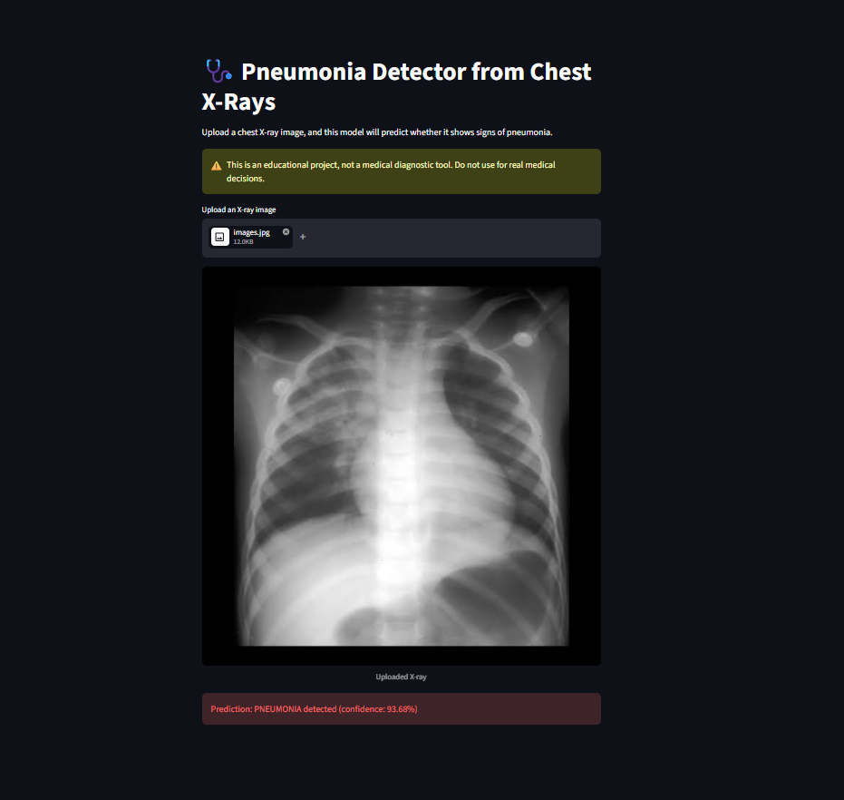

# 🩺 Pneumonia Detector from Chest X-Rays

A deep learning project that classifies chest X-ray images as **NORMAL** or **PNEUMONIA**, built from scratch as a portfolio project covering the full ML workflow: data exploration, baseline modeling, CNN training, evaluation, and deployment via an interactive web app.

> ⚠️ **Disclaimer:** This project is for educational purposes only and is **not** a medical diagnostic tool. Do not use it for real medical decisions.

---

## 📌 Overview

Pneumonia is diagnosed in part through visual inspection of chest X-rays, but this can require expert radiological interpretation. This project explores whether a convolutional neural network (CNN) can learn to distinguish pneumonia-affected lungs from healthy ones, and compares its performance against a simple baseline model.

**Dataset:** [Chest X-Ray Images (Pneumonia)](https://www.kaggle.com/datasets/paultimothymooney/chest-xray-pneumonia) by Paul Mooney (Kaggle) — 5,856 labeled chest X-ray images split into train/validation/test sets.

---

## 🔍 Approach

1. **Exploratory Data Analysis** — inspected class distribution, image sizes, and sample images across NORMAL/PNEUMONIA classes.
2. **Data Cleaning** — the original dataset's validation set was too small (16 images) to be reliable, so it was rebalanced by moving 300 images from the training set.
3. **Preprocessing** — all images resized to 150x150, converted to grayscale, and normalized to a 0–1 pixel range.
4. **Baseline Model** — a Logistic Regression classifier trained on flattened pixel data, to establish a "before deep learning" benchmark.
5. **CNN Model** — a convolutional neural network (3 convolutional blocks + dense layers) built with TensorFlow/Keras, trained with data augmentation and early stopping to prevent overfitting.
6. **Evaluation** — compared baseline vs. CNN performance on validation and held-out test data.
7. **Deployment** — built an interactive Streamlit app for real-time predictions on uploaded X-ray images.

---

## 📊 Results

| Model | Validation Accuracy | Test Accuracy |
|---|---|---|
| Logistic Regression (baseline) | 95.6% | — |
| CNN (with augmentation) | ~96% | 83.3% |

**Test set classification report (CNN):**

| Class | Precision | Recall | F1-score |
|---|---|---|---|
| NORMAL | 0.98 | 0.57 | 0.72 |
| PNEUMONIA | 0.79 | 0.99 | 0.88 |

### A note on the test accuracy drop

While validation accuracy reached ~96%, test accuracy dropped to 83%, with NORMAL recall falling to 57% — meaning the model over-predicted pneumonia on the test set. This is a **known characteristic of this specific dataset**: the test set has a different visual distribution than the training/validation sets (likely due to different source hospitals or imaging equipment), a pattern widely reported by others who've worked with this dataset.

Rather than hide this, I think it's a useful finding: it highlights the real-world challenge of **distribution shift** in medical imaging datasets, and why a model performing well on validation data doesn't guarantee it will generalize to new sources of data. In a production setting, this would be addressed with techniques like transfer learning from a pretrained model, more diverse training data, or threshold calibration.

Notably, PNEUMONIA recall remained high (0.99) throughout — the model rarely misses an actual pneumonia case, which is the more clinically important error to minimize (a missed diagnosis is worse than a false alarm).

---

## 🖥️ App Demo

The trained CNN is served through a simple Streamlit interface: upload a chest X-ray image, and the app returns a prediction with a confidence score.



---

## 🛠️ Tech Stack

- **Python**
- **TensorFlow / Keras** — CNN model
- **scikit-learn** — baseline model & evaluation metrics
- **Streamlit** — interactive web app
- **NumPy, Pandas, Matplotlib, PIL** — data handling & visualization

---

## 📂 Project Structure

```
pneumonia-detector/
├── data/                  # dataset (not included in repo — see Setup)
├── notebooks/
│   └── 01_explore_data.ipynb   # EDA, preprocessing, baseline, CNN training
├── src/                   # (reserved for future script-based refactor)
├── app/
│   └── streamlit_app.py   # Streamlit inference app
├── models/                # trained model files (not included — see Setup)
├── requirements.txt
└── README.md
```

---

## ⚙️ Setup & Usage

### 1. Clone the repository
```bash
git clone https://github.com/adithyaj2006/pneumonia-detector.git
cd pneumonia-detector
```

### 2. Set up a virtual environment
```bash
python -m venv venv
venv\Scripts\activate      # Windows
pip install -r requirements.txt
```

### 3. Download the dataset
Download [Chest X-Ray Images (Pneumonia)](https://www.kaggle.com/datasets/paultimothymooney/chest-xray-pneumonia) from Kaggle and extract it into `data/chest_xray/`.

### 4. Train the model
Run through `notebooks/01_explore_data.ipynb` to preprocess the data and train the CNN. This will save a trained model to `models/pneumonia_cnn_model.keras`.

### 5. Run the app
```bash
cd app
streamlit run streamlit_app.py
```

---

## 🚀 Future Improvements

- Apply transfer learning (e.g. MobileNetV2, VGG16) to improve generalization to the test distribution
- Threshold tuning to better balance precision/recall on unseen data
- Expand training data diversity to reduce distribution shift sensitivity
- Add Grad-CAM visualizations to show which regions of the X-ray influenced each prediction

---

## 🖥️ Live Demo
Try it here: https://pneumonia-detector-52kneffb5wtyptsmvyjyqp.streamlit.app/


---

## 📄 License

This project is for educational purposes. Dataset credit: Paul Mooney, Kaggle ([Chest X-Ray Images (Pneumonia)](https://www.kaggle.com/datasets/paultimothymooney/chest-xray-pneumonia)).
